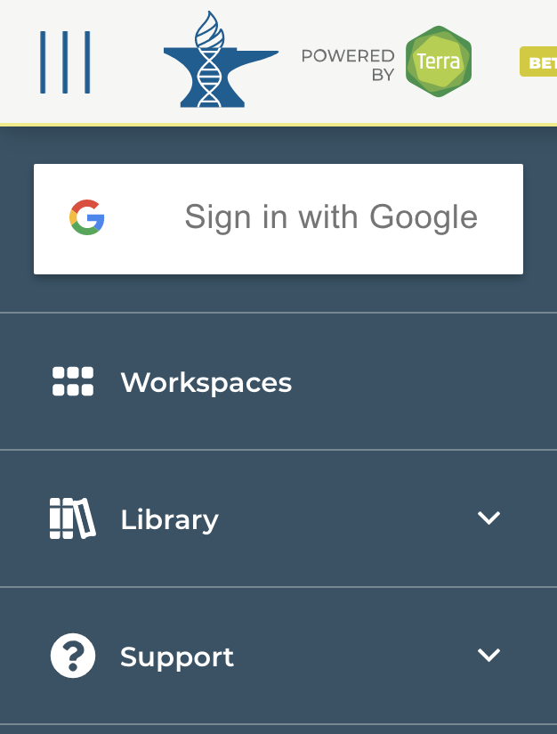

# Introduction to the Terra/AnVIL Cloud-based Genomics Platform

## Instructor names and contact information
Sehyun Oh* <Sehyun.Oh@sph.cuny.edu> [1]   
Levi Waldron* <Levi.Waldron@sph.cuny.edu> [1]   
Lori Shepherd <lori.shepherd@roswellpark.org> [2]   
Nitesh Turaga <Nitesh.Turaga@roswellpark.org> [2]   
Martin Morgan <martin.morgan@roswellpark.org> [2]   
BJ Stubbs <rebjh@channing.harvard.edu> [3]   
Vince Carey <stvjc@channing.harvard.edu> [3]    

[1] CUNY Graduate School of Public Health and Health Policy and Institute for Implementation Science in Population Health, New York, 10027, USA   
[2] Roswell Park Comprehensive Cancer Center, Buffalo, New York, 14203, USA   
[3] Channing Division of Network Medicine, Harvard Medical School, Boston, Massachusetts, 02115, USA 
   
   

## Workshop Description

The rapidly growing size of genomic datasets introduces 
challenges of data transfer, storage, access, sharing, and computing. In this workshop, 
we introduce cloud-based genomics platform [Terra](https://anvil.terra.bio/) 
as a potential solution. Terra hosts large-scale genomic and genomic-related data 
sets and provide secure remote access to them and to individually uploaded data resources. Terra
also provides on-demand computational capacity through Google Cloud Platform, and 
interactive analysis interfaces such as Jupyter notebook and RStudio. Users can 
run best practice tools and pipelines already implemented or upload their own
data or analysis methods to workspaces. Workshop participants will learn how to
use Terra through the use-case examples, instructor-led live demonstration, and the 
Bioconductor AnVIL package. 

This workshop is supported by the [NHGRI Genomic Data Science Analysis, Visualization and Informatics Lab-space (AnVIL)](https://www.genome.gov/Funded-Programs-Projects/Computational-Genomics-and-Data-Science-Program/Genomic-Analysis-Visualization-Informatics-Lab-space-AnVIL)

## Pre-requisites

* Basic knowledge of R syntax
* [Terra](https://app.terra.bio/#) account setup.     
1. Visit https://app.terra.bio/#    
2. Select the ‘HAMBURGER’ menu in the top left corner   
3. Choose ‘Sign in with Google’   
  

## Workshop Participation

Participants will have the opportunity to access a pre-populated Terra workspace and run examples. 

## _R_ / _Bioconductor_ packages used

* [AnVIL](https://github.com/Bioconductor/AnVIL)

## Time outline

| Activity                                              | Time |
|-------------------------------------------------------|------|
| Account Setup                                         | 5m   |
| Overview                                              | 15m  |
| Use Cases                                             | 10m  |
| Live Demo                                             | 25m  |

## Learning Goals

* Gain familiarity with cloud-based genomics platforms
* Learn how to access data sets and tools provided through Terra
* Learn how to use interactive analysis apps, including group sharing of a workspace and billing
* Understand the benefit and shortcome of Terra
 
## Specific objectives

* Setup Terra account
* Clone a public/sharable workspace 
* Create a new workspace and import datasets/ workflows/ notebooks
* Use Jupyter notebook and RStudio in Terra
* Use AnVIL package to access Terra and R/Bioconductor resource
  
