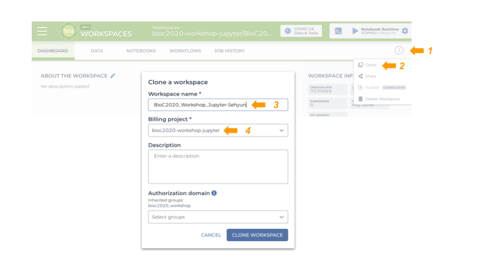
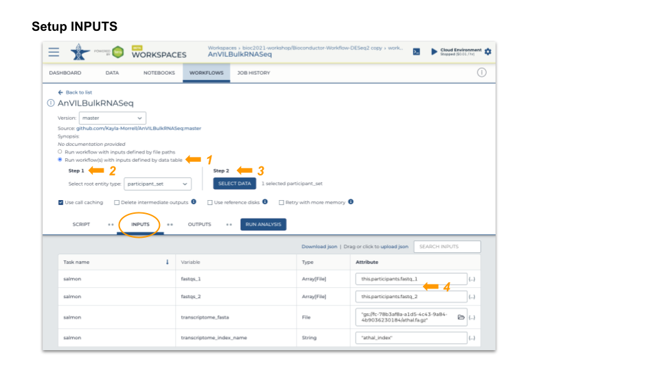
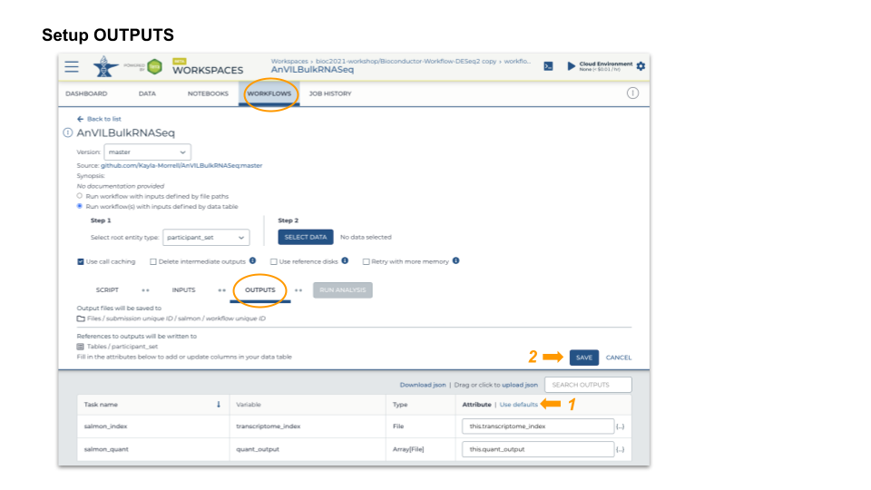
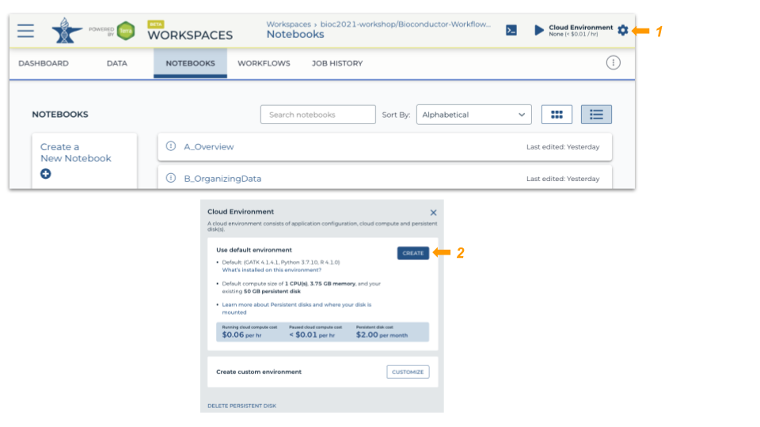

```{r, include = FALSE}
knitr::opts_chunk$set(
  collapse = TRUE,
  comment = "#>",
  eval = FALSE
)
```


# RNAseq analysis   
## Clone workspace
This workspace performs bulk RNASeq differential expression from FASTQ files. 
Salmon quantification step is implemented in WORKFLOWS and the downstream 
analysis by DESeq2 is available under NOTEBOOKS.

1. Login to Terra and navigate to **"Bioconductor-Workflow-DESeq2"** workspace  
2. Clone this workspace:    
- Assign a *unique* workspace name   
- Use the billing project, **"bioc2021-workshop"**   



## Run workflow

* Inputs   
  - Transcriptome fasta file   
  - Per-sample paired-end fastq files  
  
* Outputs   
  - Per-sample counts of reads aligned to known transcripts   
  - 'Ultra fast' aligner: should take about 20 minutes for the largest fastq file 

* Launch
  - SELECT DATA from participant_set
  - Connect workflow INPUTS to columns in the participant table (FASTQ files), 
  workspace bucket (transcriptome FASTA file), or direct entry (transcriptome name)
  - Use default OUTPUTS
  - SAVE
  - RUN ANALYSIS




## Interactive analysis   
### Set up cloud environment  

* Start a Jupyter Notebook interactive environment



* Package update
  - When the runtime is ready, launch an interactive shell to update packages
  - An interactive shell is 'better' for updating packages because we can see 
  progress/errors; these are hidden by the Jupyter notebook
  - Start R, update installed packages, and install current version of the 
  AnVIL package

```{bash eval=FALSE}
root@...> R

options(Ncpus = 2)    # faster installation, even if runtime 'oversubscribed'
BiocManager::install(ask = FALSE)           # update installed packages
pkgs <- c("Bioconductor/AnVIL", "GenomicFeatures", "tximport", "DESeq2")
BiocManager::install(pkgs)    # latest AnVIL package
```

### Contents
* Notebooks A, B and C describe how the workspace was set up; review at your 
leisure. This material may be useful when running on your own data.   

* Notebook D_ManagingWorkflowOutput
  - Extracts relevant files from the workflow output to the local disk
  - Open in 'EDIT' mode
  - Enter each evaluation cell and press <return>

* Notebook E_DESeq2Analysis
  - Creates an object suitable for use in the [ DESeq2](http://bioconductor.org/packages/release/bioc/vignettes/DESeq2/inst/doc/DESeq2.html) vignette.
