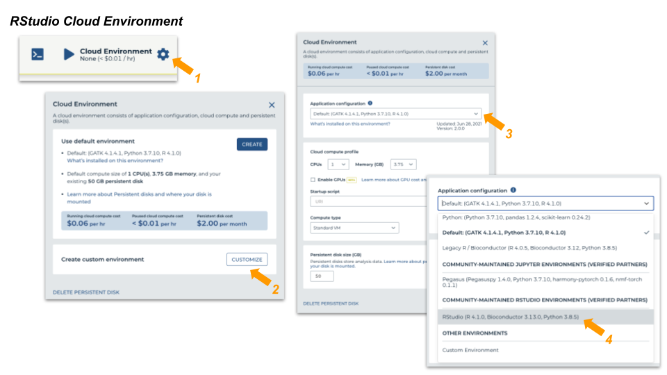
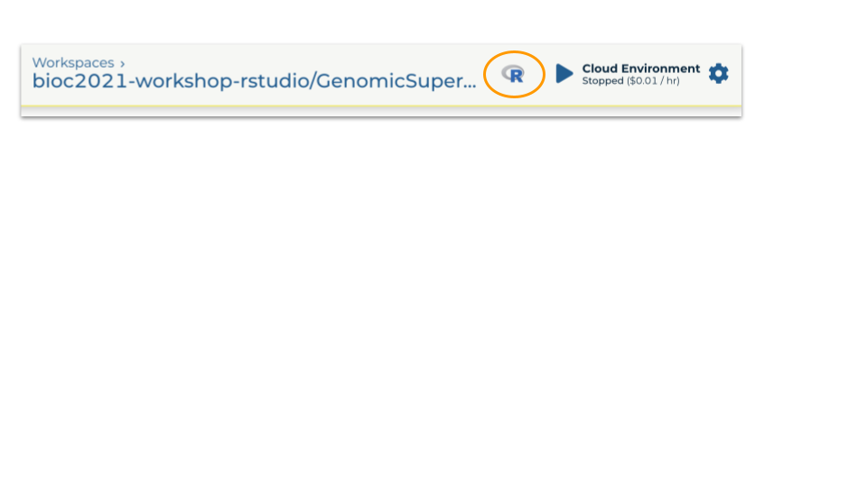

```{r, include = FALSE}
knitr::opts_chunk$set(
  collapse = TRUE,
  comment = "#>",
  eval = FALSE
)
```


# RNAseq analysis   
## Clone workspace
This workspace performs bulk RNASeq differential expression from FASTQ files. 
Salmon quantification step is implemented in WORKFLOWS and the downstream 
analysis by DESeq2 is available under NOTEBOOKS.

1. Login to Terra and navigate to **"Bioconductor-Workflow-DESeq2"** workspace  
2. Clone this workspace:    
- Assign a *unique* workspace name   
- Use the billing project, **"bioc2021-workshop"**   


## Run workflow

* Inputs   
  - Transcriptome fasta file   
  - Per-sample paired-end fastq files  
  
* Outputs   
  - Per-sample counts of reads aligned to known transcripts   
  - 'Ultra fast' aligner: should take about 20 minutes for the largest fastq file 

* Launch
  - SELECT DATA from participant_set
  - Connect workflow INPUTS to columns in the participant table (FASTQ files), 
  workspace bucket (transcriptome FASTA file), or direct entry (transcriptome name)
  - Use default OUTPUTS
  - SAVE
  - RUN ANALYSIS


## Interactive analysis   
### Set up cloud environment  

* Start a Jupyter Notebook interactive environment


* Package update
  - When the runtime is ready, launch an interactive shell to update packages
  - An interactive shell is 'better' for updating packages because we can see 
  progress/errors; these are hidden by the Jupyter notebook
  - Start R, update installed packages, and install current version of the 
  AnVIL package

```{bash eval=FALSE}
root@...> R

options(Ncpus = 2)    # faster installation, even if runtime 'oversubscribed'
BiocManager::install(ask = FALSE)           # update installed packages
pkgs <- c("Bioconductor/AnVIL", "GenomicFeatures", "tximport", "DESeq2")
BiocManager::install(pkgs)    # latest AnVIL package
```

### Contents
* Notebooks A, B and C describe how the workspace was set up; review at your 
leisure. This material may be useful when running on your own data.   

* Notebook D_ManagingWorkflowOutput
  - Extracts relevant files from the workflow output to the local disk
  - Open in 'EDIT' mode
  - Enter each evaluation cell and press <return>

* Notebook E_DESeq2Analysis
  - Creates an object suitable for use in the [ DESeq2](http://bioconductor.org/packages/release/bioc/vignettes/DESeq2/inst/doc/DESeq2.html) vignette.


# GenomicSuperSignature
## AnVILPublish
### Package installation
If necessary, install the AnVILPublish library.

```{r message=FALSE, eval=FALSE}
if (!"AnVILPublish" %in% rownames(installed.packages()))
    BiocManager::install("AnVILPublish")
```

There are only a small number of functions in the package; it is
likely best practice to invoke these using `AnVILPublish::...()`
rather than attaching the package to the search path.

### The `gcloud` SDK
It is necessary to have the [gcloud SDK](https://cloud.google.com/sdk) 
available to copy notebook files to the workspace. Test availability with
```{r}
AnVIL::gcloud_exists()
```

```{r eval=FALSE}
AnVIL::gcloud_account("shbrief@gmail.com")  # UPDATE WITH YOUR EMAIL!!!
AnVIL::gcloud_project("bioc2021-workshop")
```


and verify that the account and project are appropriate (consistent
with AnVIL credentials) for use with AnVIL.
```{r eval=FALSE}
AnVIL::gcloud_account()
AnVIL::gcloud_project()
```

Note that these be used to set, as well as interrogate, the account and project.

### `notedown` software
Conversion of .Rmd vignettes to .ipynb notebooks uses [notedown](https://github.com/aaren/notedown)
python software. It must be available from within _R_, e.g.,

```{r echo=FALSE, eval=FALSE}
Sys.setenv(PATH="/usr/local/sbin:/usr/local/bin:/usr/sbin:/usr/bin:/sbin:/bin:/usr/games:/usr/local/games:/snap/bin:/home/rstudio/.local/bin")
```

```{r}
system2("notedown", "--version")
```
 

### Workspace from package source
```{r eval=FALSE}
AnVILPublish::as_workspace(
    "path/to/package",
    "billing-project-name",     # i.e., billing account
    create = TRUE               # use update = TRUE for an existing workspace
)
```

For this vignette, I cloned GenomicSuperSignature repo through https.
```{bash eval=FALSE}
git clone https://github.com/shbrief/GenomicSuperSignature.git
```

From the below code, I create [this workspace](https://anvil.terra.bio/#workspaces/bioc2021-workshop/Bioconductor-Package-GenomicSuperSignature).

```{r message=FALSE, eval=FALSE}
AnVILPublish::as_workspace(
    path = "/home/rstudio/GenomicSuperSignature/",   # package source
    namespace = "bioc2021-workshop",   # billing account
    create = TRUE,
    use_readme = TRUE
)
```


## Analysis in RStudio
### Clone workspace
We will try GenomicSuperSignature [analyses](https://shbrief.github.io/GenomicSuperSignaturePaper/) 
using RStudio in Terra. 

First, clone the workspace using this billing address:   
  - Template workspace : `bioc2021-workshop-rstudio/GenomicSuperSignaturePaper`   
  - Billing : `bioc2021-workshop-rstudio`

### Choose cloud environment
You can choose the cloud environment of your workspace at the project level.
Currently, to use RStudio in Terra, you should use one of the custom 
environments. Below screen captures show how to do it.

 

1 & 2. At the top right, click on "Cloud Environment" and click "Customize"    
3 & 4. Under "Application Configuration" choose a community-maintained RStudio 
environment, "RStudio". Select CPU 4 for our example. (You can reduce the 
number of CPUs to 2 and the persistent disk size to 20GB to reduce the 
costs, unless  you need more. You can always increase them later at any time.)
Click "Create".    

<br>

You should then see an R icon in the top-right hand corner, which starts 
RStudio in your browser. The first time you do this, or after you haven't used 
it for some hours, it will take a minute or two to start up. You won't have to 
repeat this unless you want to change your compute resources.   



Terra will pause the computing environment automatically after a period of 
inactivity to avoid unnecessary costs, and you can tune the compute resources 
to what you need for your analysis. You can upload and download files through 
RStudio. Your work will remain saved on your persistent disk.

### Install packages/ Download data
Once your RStudio is ready, run the start-up script from **terminal**, This
start-up script is written under the DASHBOARD. This will take a few minutes.

```{bash eval=FALSE}
R -e 'BiocManager::install("AnVIL");
      fpath <- AnVIL::avbucket(namespace = "bioc2021-workshop-rstudio", name = "GenomicSuperSignaturePaper");
      fnames <- AnVIL::avfiles_ls(namespace = "bioc2021-workshop-rstudio", name = "GenomicSuperSignaturePaper");
      AnVIL::gsutil_cp(file.path(fpath, fnames), ".")'
chmod 711 startup.sh
./startup.sh

rm /home/rstudio/install_R_pkgs.R
rm /home/rstudio/pkgs_to_install.rds
rm /home/rstudio/startup.sh
```

   


# Microbiome analysis
## Runnable workflow package
For R users with the limited computing resources, we introduce RunTerraWorkflow 
package. This package allows users to run workflows implemented in 
[Terra](https://app.terra.bio/#) without writing any workflow, installing 
software, or managing cloud resources. Terra's computing resources rely on 
Google Cloud Platform (GCP) and to use RunTerraWorkflow, you only need to 
setup the Terra account once at the beginning.

Using [AnVIL](https://github.com/Bioconductor/AnVIL) package, RunTerraWorkflow 
allows users to access both Terra and GCP through R session from a conventional 
laptop, greatly lowers the learning curve for high-performance, cloud-based 
genomics resources.


## bioBakery
[bioBakery workflows](https://github.com/biobakery/biobakery_workflows) is a 
collection of workflows and tasks for executing common microbial community 
analyses using standardized, validated tools and parameters. bioBakery is 
built and maintained by [Huttenhower lab](http://huttenhower.sph.harvard.edu/).

You can find the usecase example of running Terra-implemented bioBakery workflow
([Whole Metagenome Shotgun (wmgx) workflow version 3](https://anvil.terra.bio/#workspaces/waldronlab-terra-rstudio/mtx_workflow_biobakery_version3_template)) 
using RunTerraWorkflow package [**HERE**](https://rpubs.com/shbrief/RunTerrraWorkflow_bioBakery). 

