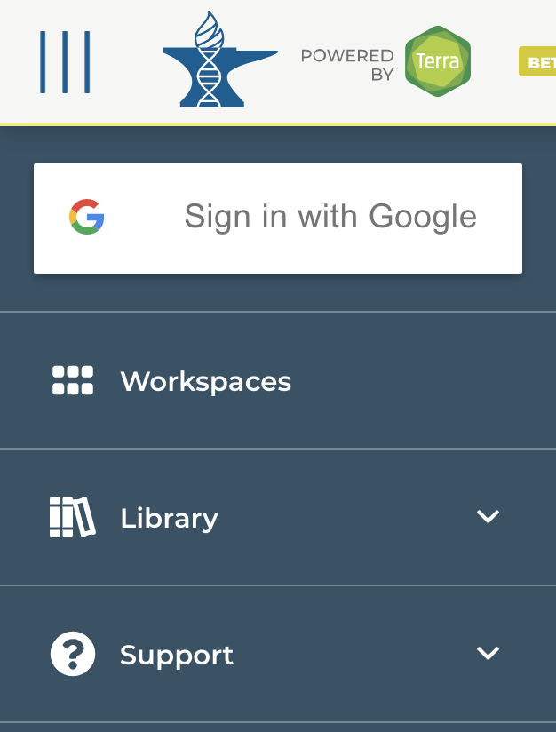

```{r, include = FALSE}
knitr::opts_chunk$set(
  collapse = TRUE,
  comment = "#>"
)
```


# Create an AnVIL/Terra account
1. Visit https://app.terra.bio/#   
2. Select the ‘HAMBURGER’ menu in the top left corner   
3. Choose ‘Sign in with Google’   
  
{width=150px, height=250px}


# Start your workspace from the existing workspaces
## From this workshop


## Share workspaces
- **Cloning** a workspace makes you the owner, and allows you to experiment with code and data in your own copy of a workspace without running the risk of affecting a group workspace. Cloning also allows you to use a different Billing Project to cover workspace analysis costs. Cloning is useful if you want to run computations in a shared workspace where you only have "read access." Cloning creates a completely independent copy of the workspace in which you are the owner and sole user. ([reference](https://support.terra.bio/hc/en-us/articles/360026130851-How-to-clone-a-workspace))

- **Sharing** a workspace allows collaborators to actively work together in the same project workspace. ([reference](https://support.terra.bio/hc/en-us/articles/360034540171-How-to-share-a-workspace))

<br>

  


# Different runtime configurations 
You can decided the runtime environement of your workspace at the project level.
Below are two example workspaces with different runtime enviornment


**1. BioC2020-Workshop-RStudio**   
Jupyter Environment `R/Bioconductor: (Python 3.7.8, R4.0.2, BiocVersion 3.11.1, tidyverse 1.3.0)`  

**2. BioC2020-Workshop-Jupyter**    
Other Environments -> Project-Specific Environment -> `us.gcr.io/anvil-gcr-public/anvil-rstudio-bioconductor:0.0.4` 

<br>

If you want to change the runtime environment of your project:


# Create your own workspace   
- From dataset   
- From tools   