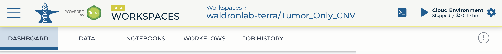

```{r, include = FALSE}
knitr::opts_chunk$set(
  collapse = TRUE,
  comment = "#>"
)
```

# Introduction
## Cloud-based genomics platforms
The rapidly growing size of genomic datasets introduces challenges of data transfer, 
storage, access, sharing, and computing. Cloud-based genomics platform is one of 
the solutions and many of them already exist hosting different dataset and analysis
tools. Below is the brief example of a few:

|Platform | Hosted Data | Analysis Tools |
|---|---|---|
| [Terra](https://anvil.terra.bio/) | CCDG, eMERGE, TCGA, TARGET, TOPMed, etc. | WDL, Notebooks, RStudio, *Galaxy (coming soon)* |
| [Seven Bridges](https://biodatacatalyst.nhlbi.nih.gov/platforms/seven-bridges) | TOPMed | CWL, Notebook, RStudio |
| [Seven Bridges](http://www.cancergenomicscloud.org/)| TCGA, TARGET, ICGC, etc. | CWL, Notebook, RStudio |
| [ISB-CGC](https://isb-cgc.appspot.com/) | TCGA, TARGET, etc. | GCP tools, such as Google BigQuery |


### Terra
In this workshop, we are focusing on Terra. Terra is the analysis platform  of [AnVIL](https://anvilproject.org/) 
(Analysis, Visualization and Informatics Lab-space) project launched by NHGRI.


Terra provides:   
1. **[Data]** secure remote access to public geneomic data without paying storage    
2. **[Workflows]** best practice tools and pipelines already implemented    
3. **[Notebooks]** interactive analysis interfaces such as Jupyter notebook and RStudio    
4. on-demand computational capacity through Google Cloud Platform   

### Setup Terra account
* Instruction on [Terra account setup](https://support.terra.bio/hc/en-us/articles/360034677651-Account-setup-and-exploring-Terra).

## What kind of analysis can you do on Terra?
Currently, [Terra supports two modes of analysis](https://support.terra.bio/hc/en-us/articles/360022714931-What-kind-of-analysis-can-you-do-on-Terra-). 

1. **Batch processing** with workflows, which includes but is not limited to:   
Read alignment   
Variant calling   
Joint filtering   

2. **Interactive analysis**, which includes but is not limited to:   
R/Python-based downstream analysis   
BigQuery   
Hail   


# Workspace
Workspace is the main buildling block of Terra, where different resources are delivered 
through. Depending on your goal, you can use workspace for hosting data, building production
pipelines, colleting analysis templates, or all of above! - You can use a Terra 
workspace to keep all the components of your project - data, metadata, and analysis 
tools as well as documentation and provenance - together.

You can find more detail about workspace in here: [Intro to working with workspace](https://support.terra.bio/hc/en-us/articles/360024743371-Intro-to-working-with-workspaces)

 

**1. Dashboard: Documentation and workspace information**  
Here is where you describe the research project - what questions you are trying to answer, what kind of data and analyses you will use, etc. Documentation is important! Well-documented workspaces make it easy to share and collaborate. This tab also includes information about the workspace owner and creation date. 

**2. Data: Organize and access data-in-the-cloud**    
Terra uses tables, which are like built-in spreadsheets, to help access and organize the data you will use. Data can be in your workspace bucket, or in Google Cloud Storage or BigQuery. Tables connect workspace tools to the data with metadata links to the actual location in the cloud.

**3. Notebooks: Interactive analysis**   
In the notebooks tab you can launch an in-app Jupyter Notebook and interact with the data using Python or R. 

**4. Workflows: Pipelining analysis**   
In the workflows tab you will find workflows for bulk analyses.These are the sorts of repetitive analyses that can be automated, such as what you would use to align sequencer reads. Workflows in Terra are written in in Workflow Description Language and are called WDLs. 

**5. Job History: Provenance and troubleshooting**   
In this tab you can check on the status of workflow submissions, and dig down into error logs for help with troubleshooting errors or submission failures. Your workspace also maintains a list of all previous submissions, for reproducibility and provenance.  


## Prebuild workspace examples
[Biocondoctor Workspace](https://app.terra.bio/#workspaces/help-gatk/Bioconductor)

## Demo
1. Create a new workspace   
2. Use an existing workspace   
3. Share a workspace with others   


# How to access datasets
{width=140px, height=300px} 

# How to access workflows
{width=500px, height=100px}


