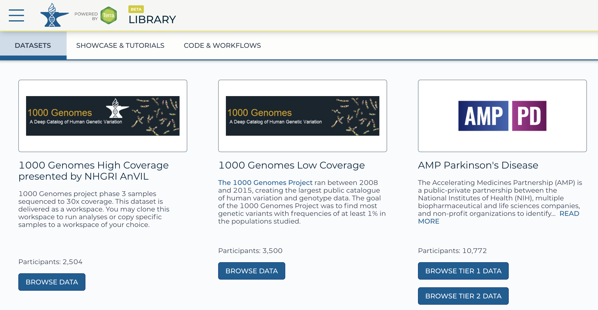
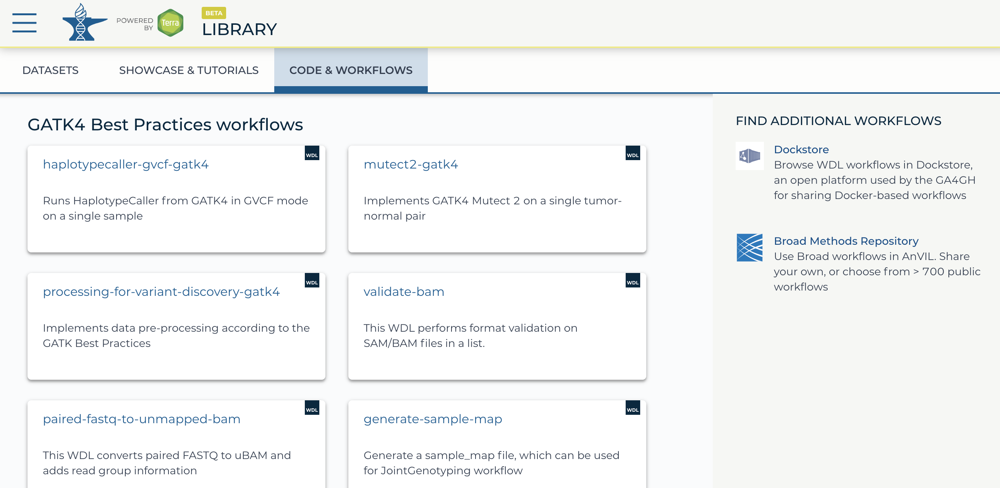

```{r, include = FALSE}
knitr::opts_chunk$set(
  collapse = TRUE,
  comment = "#>"
)
```

<br>

# Introduction
### Cloud-based genomics platforms
The rapidly growing size of genomic datasets introduces challenges of data transfer, 
storage, access, sharing, and computing. Cloud-based genomics platform is one of 
the solutions and many of them already exist hosting different dataset and analysis
tools. Below is the brief example of a few:

|Platform | Hosted Data | Analysis Tools |
|---|---|---|
| [Terra](https://anvil.terra.bio/) | CCDG, eMERGE, TCGA, TARGET, TOPMed, etc. | WDL, Notebooks, RStudio, *Galaxy (coming soon)* |
| [Seven Bridges](https://biodatacatalyst.nhlbi.nih.gov/platforms/seven-bridges) | TOPMed | CWL, Notebook, RStudio |
| [Seven Bridges](http://www.cancergenomicscloud.org/)| TCGA, TARGET, ICGC, etc. | CWL, Notebook, RStudio |
| [ISB-CGC](https://isb-cgc.appspot.com/) | TCGA, TARGET, etc. | GCP tools, such as Google BigQuery |


### Terra
In this workshop, we are focusing on Terra. Terra is the analysis platform  of [AnVIL](https://anvilproject.org/) (Analysis, Visualization and Informatics Lab-space) project launched by NHGRI.

#### Terra provides:   
**1. Data** : secure remote access to public geneomic data without paying storage (powered by [GEN3](https://gen3.org/))       
**2. Workflows** : best practice tools and pipelines already implemented (powered by [Dockstore](https://dockstore.org/))    
**3. Notebooks** : interactive analysis interfaces such as Jupyter notebook (default), 
RStudio (custom environemtn), and Galaxy (coming soon)       
**4. On-demand computational capacity** through Google Cloud Platform   


### What kind of analysis can you do on Terra?
Currently, [Terra supports two modes of analysis](https://support.terra.bio/hc/en-us/articles/360022714931-What-kind-of-analysis-can-you-do-on-Terra-). 

**1. Batch processing** with workflows, which includes but is not limited to: Read 
alignment, Variant calling, Joint filtering    
**2. Interactive analysis**, which includes but is not limited to: R/Python-based 
downstream analysis, BigQuery, Hail   

<br>

# Workspace
Workspace is **the main buildling block** of Terra, where different resources are delivered 
through. Depending on your goal, you can use a workspace for hosting data, building production
pipelines, collecting analysis templates, or all of above! - You can use a Terra 
workspace to keep all the components of your project - data, metadata, and analysis 
tools as well as documentation and provenance - together.

You can find more detail about workspace in here: [Intro to working with workspace](https://support.terra.bio/hc/en-us/articles/360024743371-Intro-to-working-with-workspaces) 
- [video](https://youtu.be/ONc1Wf7rEuw) (By Broad's Terra team)


<br>

**1. Dashboard: Documentation and workspace information**  
Here is where you describe the research project - what questions you are trying to answer, what kind of data and analyses you will use, etc. Documentation is important! Well-documented workspaces make it easy to share and collaborate. This tab also includes information about the workspace owner and creation date. 

**2. Data: Organize and access data-in-the-cloud**    
Terra uses tables, which are like built-in spreadsheets, to help access and organize the data you will use. Data can be in your workspace bucket, or in Google Cloud Storage or BigQuery. Tables connect workspace tools to the data with metadata links to the actual location in the cloud.

**3. Notebooks: Interactive analysis**   
In the notebooks tab you can launch an in-app Jupyter Notebook and interact with the data using Python or R. 

**4. Workflows: Pipelining analysis**   
In the workflows tab you will find workflows for bulk analyses. These are the sorts of repetitive analyses that can be automated, such as what you would use to align sequencer reads. Workflows in Terra are written in in Workflow Description Language and are called WDLs. 

**5. Job History: Provenance and troubleshooting**   
In this tab you can check on the status of workflow submissions, and dig down into error logs for help with troubleshooting errors or submission failures. Your workspace also maintains a list of all previous submissions, for reproducibility and provenance.  


<br>

# How to explore Terra resources
Terra has three distinct libraries that can be used as resources to build the workspace 
you need for your analysis. To access the libraries, click the Hamburger button (three 
horizontal lines) at the top left of any page and open the "Library" submenu. Under the 
Library submenu, you can see the list of Terra's major resources: Data, Showcase, and Workflows.


## Data
Terra hosts both open- and controlled-access datasets. Select datasets have built-in 
functionality ("Data Explorers) for exploring - and creating customized subsets from 
- the data. 

Here are the available datasets in Terra through various awards:   
- AnVIL : CCDG (Centers for Common Disease Genomics), CMG (Center for Mendelian genomics), 
GTEx (Genotype-Tissue Expression Project), eMERGE (Electronic medical records and genomics)    
- STAGE : TOPMed  (Trans-Omics for Precision Medicine)    
- NHS (The Nurses' Health Study)      
- HCA (The Human Cell Atlas)      
- ENCODE (The *Enc*yclopedia *O*f *D*NA *E*lements)    
- TCGA (The Cancer Genome Atlas), TARGET (*T*umor *a*lterations *r*elevant for *ge*nomics-driven *t*herapy)   


Note that registering for Terra itself does not automatically grant access 
to all available data.



<br>

## Showcase
Showcase & Tutorials (template workspaces) are intended to ensure users to reproduce
instructive resssults and learn establisehd methodologies.

**Example (GATK) workspaces**   
- Showcase reproducible examples of GATK workflows and tools for general use   
- Many contain tools developed at and supported by Broad   

**Featured workspaces**   
- Tutorial workspaces    
- Specific use cases based on published work   
- Give users a chance to understand their peers' experimental design   


<br>

## Workflows
The Code & Workflows section contains various tools and tasks that make up components of workflows. Users familiar with running workflows can use this repository to find workflow components to run individually or to string together using Workflow Description Language (WDL).

This section also includes links to other helpful open source workflow repositories. Look to the right of the Code & Workflows tab under "FIND ADDITIONAL WORKFLOWS."




