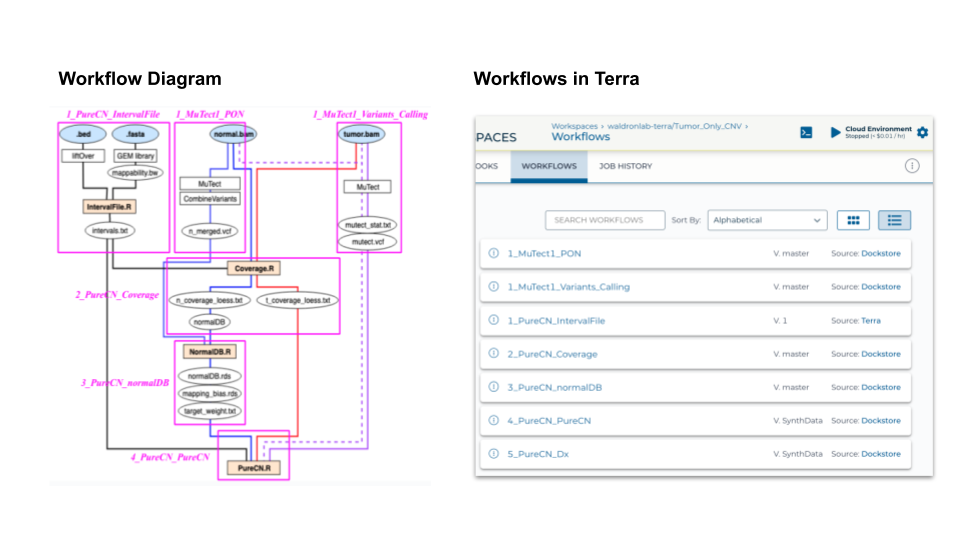
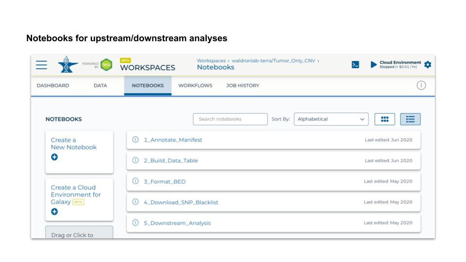

```{r, include = FALSE}
knitr::opts_chunk$set(
  collapse = TRUE,
  comment = "#>"
)
```


# Terra in the classroom 
### Share Workspace
Terra workspace allows setup of a lecture or lab in advance of sharing it, where 
everyone uses the same runtime environment - no setup or compatibility issues. Also, 
creating runtime is very intutive with the cost/hr information. 

**How to share:**   
1) Collect Google emails of all students (if institution is using GSuite, can be institutional emails)   
2) “Create a new group” at https://app.terra.bio/#groups (Note: group name must be (universally?) unique)   
3) Scroll down or type to find this group, and click   
4) Click “Add User” and enter email address. Repeat for each email address   


**Benefits:**   
- Workspaces can be shared with group in one step   
- Read/write/own options   
- Can share compute resources on any particular workspace   
- Can remove or change permissions or group members at any time   
- Set permissions per workspace   


### Control Billing
**How to setup:**   
Need a [Google Cloud Platform billing account](https://console.cloud.google.com/)   
- Can use educational credits billing account   
- Can use [Onix billing account](https://www.onixnet.com/onspend-cloud-billing)   
- Can use regular billing account backed by credit card   

**Positives:**   
- Each student selects a compute environment with known cost per hour:    
each student can select what they need     
- Terra auto-suspend of notebook runtimes helped keep costs low     
- Students only have to login, don’t have to set up billing

**Negatives:**   
- Each student selects a compute environment with known cost per hour:      
No way to identify an over-spending student or to limit what runtime they must use   
- No cost breakdown per student

**Notes:**   
- Billing is post-pay (you can find out how much has been spent with ~24h delay)


# Terra for paper
### Introduction
[This workspace](https://app.terra.bio/#workspaces/waldronlab-terra/Tumor_Only_CNV) provides a fully reproducible example of copy number variation (CNV) and single nucleotide variants (SNV) analysis of tumor samples without matching normal profile, described in the recent publication [[link](https://ascopubs.org/doi/10.1200/CCI.19.00130)].    

**Reliable analysis of clinical tumor-only whole exome sequencing data**       
Oh *et al.*, JCO Clin Cancer Inform. 2020 Apr;4:321-335. doi: 10.1200/CCI.19.00130.   

### Benefits
The major benefits of having Terra workspace with research paper are:   
1) Data storage, pipeline (compute-intense), and downstream analysis are all available in one place   
2) Improved reproducibility   
3) Sharing code and providing additional information not included in the paper are available through the workspace   


### Features
**1. Data**   
- Paper used TCGA controlled data (BAM files) → Synthetic dataset for public workspace   
- Public reference files (stored in GCP, some are directly available through Terra)   
- Researcher’s own data (BED, COSMIC VCFs stored in GCP) → some available with ‘Requester pays’   

**2. Workflows**   
Left side of the diagram summarizes the CNV/SNV analysis workflow this paper used. 
Pink boxes around each segment of the pipeline are built into 7 WDL workflows in 
Terra, based on their modulatiry, input/output requirements. The numbered prefix
represents the order each workflows should run. For example, `1_MuTect1_PON`, 
`1_MuTect1_Variants_Calling`, and `1_PureCN_IntervalFile` can run all at the same
time because they don't have any dependence on other workflows for their inputs.

These workflows incorporate many different runtime environments (e.g. GATK, MuTect, 
Bioconductor,...) through one string input!




**3. Notebooks**   
- 5 Jupyter notebooks using R → 4 for data pre-processing and 1 for downstream analysis   
- AnVIL package enables a smoother connection between ‘Data’ and ‘Notebooks’   



